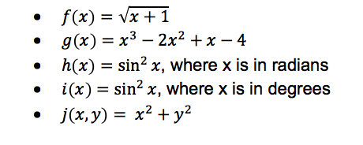

# a2 Assignment 2

A separate NetBeans project has been provided for each assignment question. Before you start your work, ensure that you have cloned this repository and created a develop branch. When you have completed the assignment, commit to your develop branch and create a pull request.

**FEEL FREE TO USE METHODS TO IMPLEMENT PORTIONS OF YOUR PROGRAMS!**

### Problem 1

Write the following math functions as methods:



Import the *java.lang.Math* package to assist with the calculations as necessary.  In your main method, ask the user to input a double value for *x* and a double value for *y*.  Output the result of each of the calculations.

### Problem 2

Input an integer called *size*. Determine the primes from 2 through *size* by using the [Sieve of Eratosthenes](https://en.wikipedia.org/wiki/Sieve_of_Eratosthenes). Program should be written as follows:
 * Use a boolean array called *primes*. 
 * Initialize all elements of the array to *true (t)*. 
 * Don't use the elements *primes[0]* or *primes[1]*. 
 * Mark non-prime numbers as *false* by following the algorithm outlined by the the Sieve of Eratosthenes.

 As an example, suppose the number 25 was entered.  Here are the first few iterations of the algorithm:

```
... the array is initialized with all elements having the value true:
2  3  4  5  6  7  8  9  10 11 12 13 14 15 16 17 18 19 20 21 22 23 24 25
t  t  t  t  t  t  t  t  t  t  t  t  t  t  t  t  t  t  t  t  t  t  t  t  

... array elements which are multiples of 2 are set to the value false:
2  3  4  5  6  7  8  9  10 11 12 13 14 15 16 17 18 19 20 21 22 23 24 25
t  t  f  t  f  t  f  t  f  t  f  t  f  t  f  t  f  t  f  t  f  t  f  t  

... array elements which are multiples of 3 are set to the value false:
2  3  4  5  6  7  8  9  10 11 12 13 14 15 16 17 18 19 20 21 22 23 24 25
t  t  f  t  f  t  f  f  f  t  f  t  f  f  f  t  f  t  f  f  f  t  f  t  

... array elements which are multiples of 5 are set to the value false:
2  3  4  5  6  7  8  9  10 11 12 13 14 15 16 17 18 19 20 21 22 23 24 25
t  t  f  t  f  t  f  f  f  t  f  t  f  f  f  t  f  t  f  f  f  t  f  f  

... ultimately the entire array has been adjusted so that only primes remain as true.
2  3  4  5  6  7  8  9  10 11 12 13 14 15 16 17 18 19 20 21 22 23 24 25
t  t  f  t  f  t  f  f  f  t  f  t  f  f  f  t  f  t  f  f  f  t  f  f  
```

Once the algorithm is complete, the elements still set to *true* are the prime numbers.  Output these prime numbers, formatted as follows (10 primes numbers to a line):

```
Enter a number: 500
All primes less than or equal to 500 are:
2         3         5         7         11        13        17        19        23        29        
31        37        41        43        47        53        59        61        67        71        
73        79        83        89        97        101       103       107       109       113       
127       131       137       139       149       151       157       163       167       173       
179       181       191       193       197       199       211       223       227       229       
233       239       241       251       257       263       269       271       277       281       
283       293       307       311       313       317       331       337       347       349       
353       359       367       373       379       383       389       397       401       409       
419       421       431       433       439       443       449       457       461       463        
467       479       487       491       499       
```

### Problem 3

Write a program that uses a 2-dimensional array to maintain a teacher's Grade Book containing their marks records. All marks are out of 100 and have equal weighting. Calculate and output student averages, test averages, and the overall class average. Your program **does not** have to work with any other data set (i.e. it can be hard-wired to only work for 13 students and 6 tests, as provided in this data set). Use the following data:

```
int gradesArray[][]={{ 56 , 38 , 38 , 88 , 52 , 42 },
                     { 85 , 35 , 91 , 94 , 60 , 47 },
                     { 78 , 62 , 70 , 42 , 93 , 65 },
                     { 33 , 75 , 82 , 45 , 73 , 83 },
                     { 60 , 80 , 71 , 82 , 73 , 38 },
                     { 80 , 55 , 48 , 59 , 36 , 80 },
                     { 30 , 91 , 79 , 81 , 61 , 61 },
                     { 47 , 54 , 68 , 64 , 73 , 65 },
                     { 32 , 54 , 84 , 52 , 64 , 80 },
                     { 82 , 82 , 39 , 65 , 48 , 41 },
                     { 65 , 81 , 81 , 38 , 93 , 86 },
                     { 44 , 74 , 64 , 61 , 58 , 77 },
                     { 31 , 31 , 44 , 93 , 52 , 94 }};
```

Output should be formatted in a table as follows:

```
Name           Test 1  Test 2  Test 3  Test 4  Test 5  Test 6  Average
-------------  ------  ------  ------  ------  ------  ------  -------
Student 1          56      38      38      88      52      42    52.33
Student 2          85      35      91      94      60      47    68.67
Student 3          78      62      70      42      93      65    68.33
Student 4          33      75      82      45      73      83    65.17
Student 5          60      80      71      82      73      38    67.33
Student 6          80      55      48      59      36      80    59.67
Student 7          30      91      79      81      61      61    67.17
Student 8          47      54      68      64      73      65    61.83
Student 9          32      54      84      52      64      80    61.00
Student 10         82      82      39      65      48      41    59.50
Student 11         65      81      81      38      93      86    74.00
Student 12         44      74      64      61      58      77    63.00
Student 13         31      31      44      93      52      94    57.50

Test Average     55.6    62.5    66.1    66.5    64.3    66.1

Class Average: 63.5
```

### Problem 4

Write a program that reads in the text file called "myText.txt" (on Mac) or "myTextWindows.txt" (on Windows).  Determine the following:
 1. The number of words in the file. A word is defined as text surrounded by whitespace (i.e. the line "A cost-effective method was used!" contains 5 words.
 2. The number of lines in the file.
 3. The longest word in the file (if there is a tie, any of the longest words will do).
 4. The length of the longest word.
 5. The average word length.

Output these values to a text file called "myTextData.txt".  Formatting should look similar to the following (the numbers are below are merely examples):

```
The file "myTextWindows.txt" was successfully read.

Number of words:     98
Number of lines:     8
Longest word:        fantastic!
Longest word length: 10
Average word length: 4.3
```

### Problem 5

Write a program that:
 1. Reads the text file "Teacher data.txt" (on Mac) or "Teacher data Windows.txt" (on Windows) into a 2D array of Strings of size 50x3 named teacherData. The columns of the data file represent
```
    <Teacher last name> <Subject area> <Number of years teaching experience>
```
 2. Uses a loop to go through the teacherData array and calculate the average number of years of teaching experience among teachers who have math, science or tech as their subject area.   Print the answer to the screen.

You must use the 2D array to do the counting (i.e. you can't count values while the data is being read in from the file).

### Problem 6

Write a program that reads in the binary file called "myMatrices.bin".  This file contains 2, 2D integer arrays.  Read the first array into a variable called *matrix1* and read the 2nd array into a variable called *matrix2*.  Write a method called *multiplyMatrices* that multiplies 2 matrices and returns the resulting matrix as a 2D array.  Print the result to the screen.  You can assume that the matrices contained in the binary file can be multpilied together (i.e. the columns of *matrix1* are equal to the rows of *matrix2*).  To make sure you are correctly reading the file, the contents of your variables will be equivalent to the definitions below:

```
        int matrix1[][] = {
            {1, 3, 5},
            {2, 4, 6},
            {-6, 0, 10}
        };
      
        int matrix2[][] = {
            {7, 8},
            {-6, -8},
            {3, 2}
        };
```
